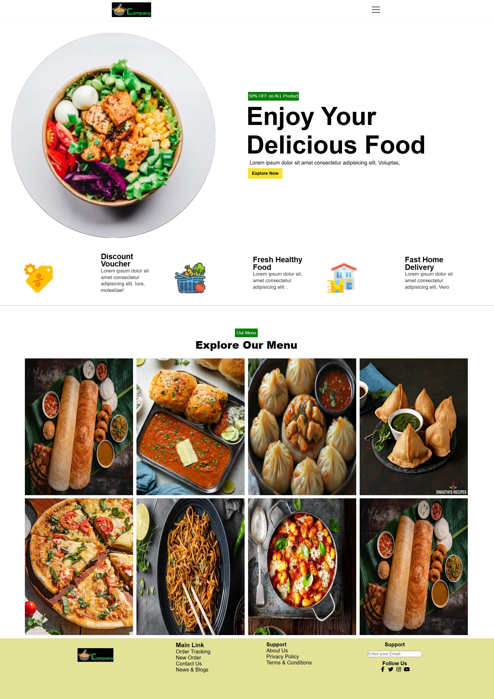
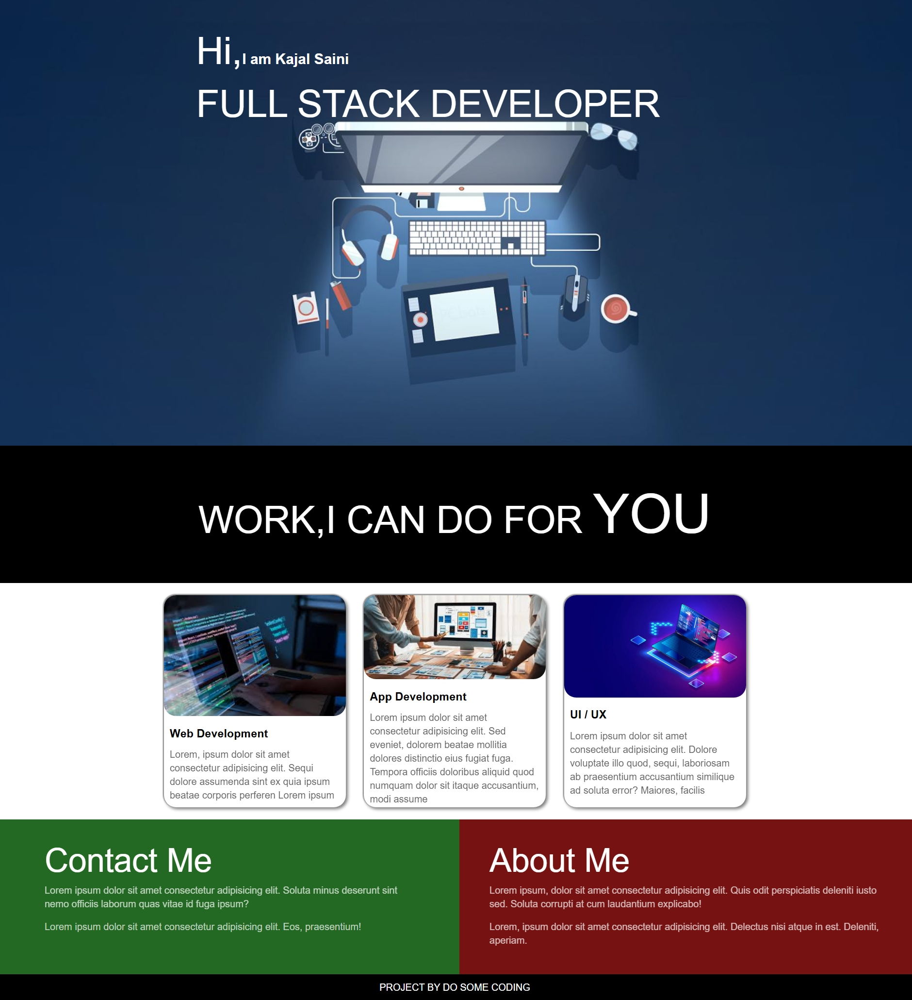
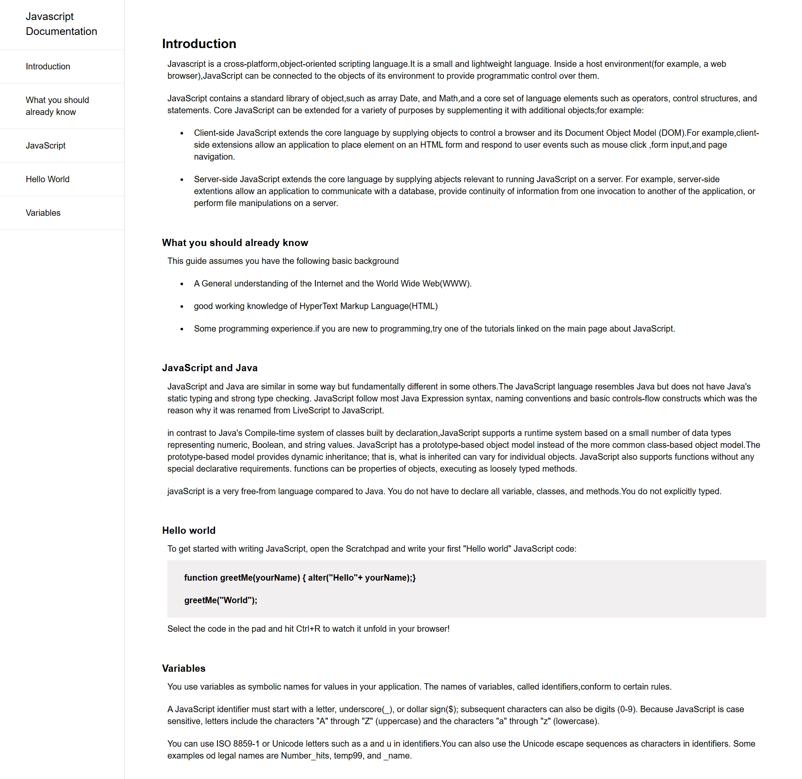
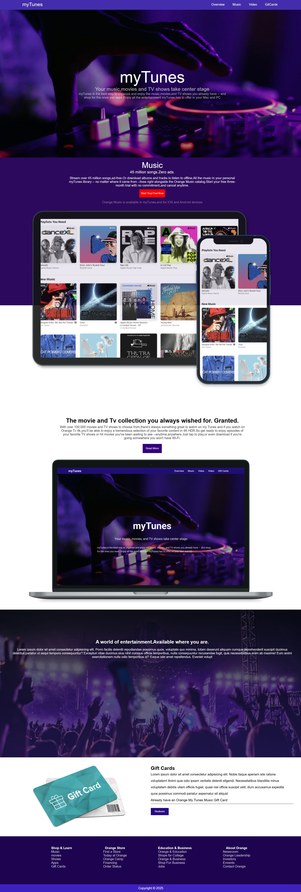
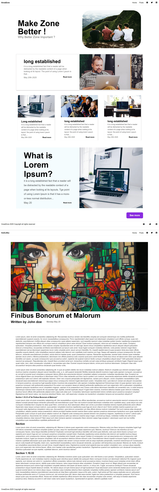

# HTML & CSS Projects

A collection of **HTML & CSS projects** created to practice and showcase **modern frontend development skills**.
These projects cover various UI layouts, responsive techniques, and creative CSS effects - perfect for beginners who want to build a solid foundation in web development.

---

## Projects Screenshots

A quick preview of some featured projects:

| Restaurant Website | Developer Page | JavaScript Documentation |
|---------------|----------------|--------------------------|
|  |  |  |

| Music Website | Bloge Website |
|---------------|--------------------|
|  |  |

> More screenshots are available in the `Projects-Screenshot` Folder for all projects.

## Projects
1. blog-page - Simple blog layout.
2. blog-website - Multi-page blog site with navigation & footer section.
3. card-project - card UI designs with hover effects.
4. developer-page - Portfolio-style page
5. javascript-documentation - Documentation layout for JS concepts.
6. Multicolor website - change the color of the website using CSS variables.
7. Music Website - Music-themed landing page.
8. Parallax Website - Website with parallax scrolling effect.
9. Restaurant Website - Landing page with menu and footer section.

## Skills Learned

- Semantic **HTML5** structure
- **CSS Flexbox** & **Grid** layouts
- **Responsive design** with media queries
- **CSS transitions**, hover effects & parallax
- **CSS variables** for theme customization

## How to Run

open any project folder and click on `index.html` in a browser.
